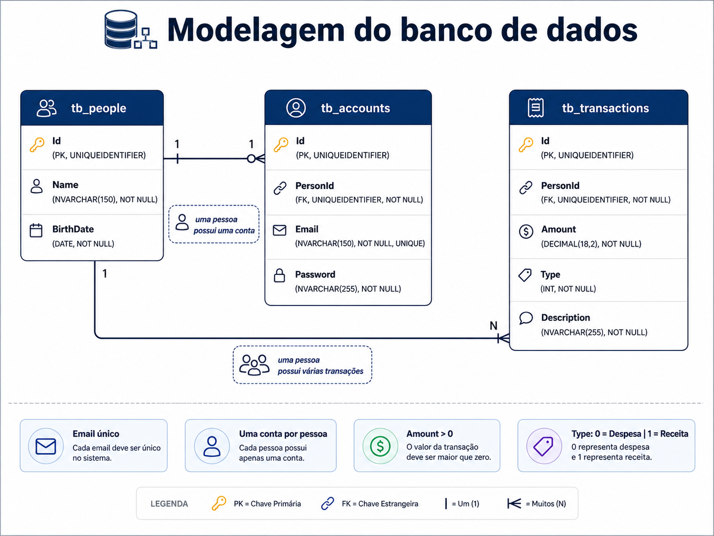
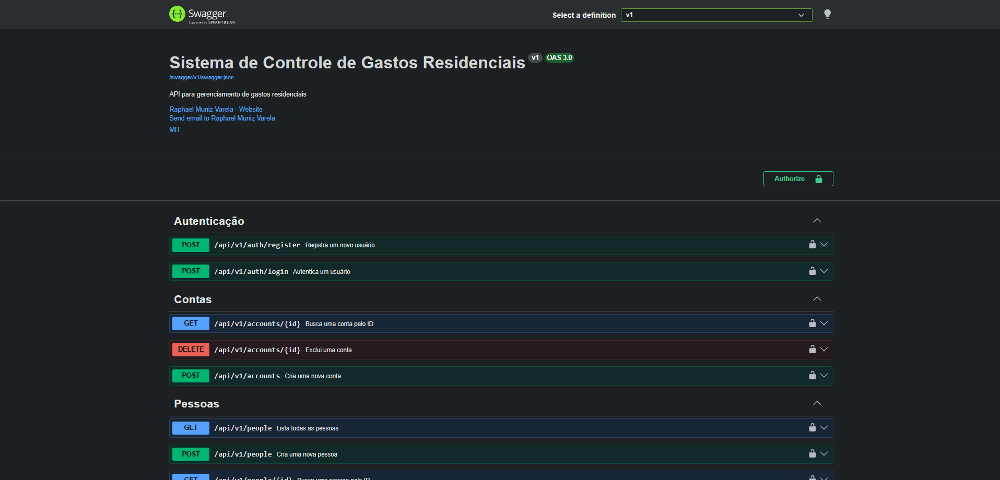
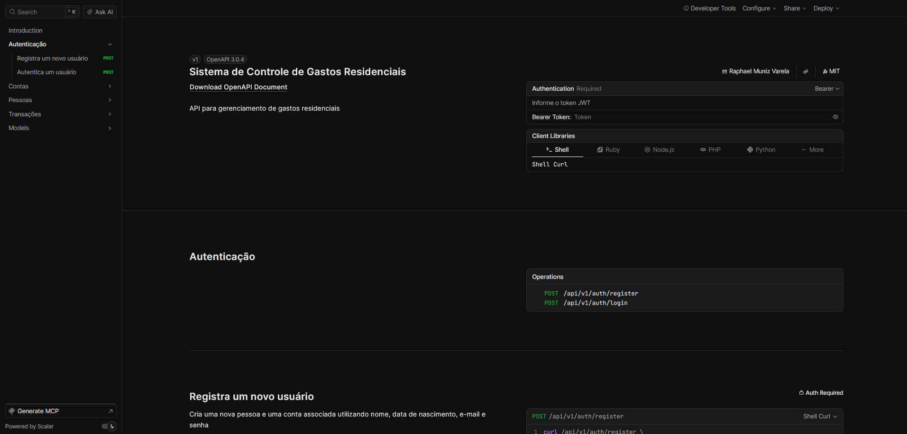

# Sistema de Controle de Gastos Residenciais

<div align="center">

<a href="https://github.com/RaphaelMun1z/csharp-dotnet-sistema-controle-gastos-residenciais/releases/tag/v1.0.0">
  
</a>


<br><br>

API REST para gerenciamento de **pessoas, contas, receitas e despesas**, desenvolvida com ASP.NET Core, persistência relacional, autenticação JWT e execução containerizada.

</div>

---

## Visão geral

O Sistema de Controle de Gastos Residenciais permite cadastrar pessoas, contas e transações financeiras, aplicando regras de negócio relacionadas ao domínio e mantendo os dados persistidos em SQL Server.

O backend utiliza ASP.NET Core com arquitetura em camadas, Entity Framework Core para persistência, JWT para autenticação, Serilog para logging, Evolve para migrações e Swagger/OpenAPI e Scalar para documentação da API.

A aplicação pode ser executada com Docker Compose, que organiza a API e o banco de dados em containers.

<div align="center">

<!-- Adicionar aqui a imagem de visão geral / arquitetura do projeto -->

</div>

<table>
<tr>
<td width="50%" valign="top">

### Backend

* C# / .NET 10
* ASP.NET Core
* Entity Framework Core
* SQL Server
* JWT Authentication
* Serilog
* Evolve

</td>
<td width="50%" valign="top">

### API e infraestrutura

* Docker
* Docker Compose
* Swagger / OpenAPI
* Scalar
* HATEOAS
* CORS
* Problem Details

</td>
</tr>
</table>

---

## Funcionalidades

<table>
<tr>
<td width="33%" valign="top">

### Pessoas

* Cadastro
* Consulta paginada
* Busca por ID
* Exclusão

</td>
<td width="33%" valign="top">

### Contas

* Cadastro
* Associação com pessoa
* Busca por ID
* Exclusão

</td>
<td width="33%" valign="top">

### Transações

* Cadastro de receitas
* Cadastro de despesas
* Consulta paginada
* Busca por ID
* Consulta por pessoa

</td>
</tr>
</table>

---

## Autenticação

A aplicação possui fluxo de registro e login com autenticação baseada em JWT.

O registro cria uma pessoa e sua respectiva conta em uma única operação. Após o login, o token JWT retornado pode ser utilizado para acessar os endpoints protegidos da API.

<div align="center">

<!-- Adicionar aqui um diagrama do fluxo de autenticação -->

</div>

A collection do Postman está disponível em:

```text
/docs/v1.0.0/Sistema de Controle de Gastos Residenciais - v1.0.0.postman_collection.json
```

Ela pode ser importada diretamente no Postman para facilitar os testes da API.

---

## Arquitetura

O backend segue uma arquitetura em camadas, separando responsabilidades entre entrada HTTP, regras de negócio e persistência.

<div align="center">

<!-- Adicionar aqui um diagrama da arquitetura em camadas -->

</div>

<table>
<tr>
<td width="50%" valign="top">

### Padrões utilizados

* Layered Architecture
* Repository Pattern
* Generic Repository
* Service Layer
* DTO Pattern
* Mapper
* Dependency Injection

</td>
<td width="50%" valign="top">

### Componentes de suporte

* JWT Authentication
* HATEOAS
* Global Exception Handler
* Problem Details
* Serilog
* CORS
* Swagger / OpenAPI

</td>
</tr>
</table>

---

## Regras de negócio

Entre as principais regras implementadas estão:

* Pessoas menores de 18 anos podem registrar apenas despesas
* Cada pessoa pode possuir apenas uma conta
* O e-mail utilizado em uma conta deve ser único
* Contas e transações devem estar vinculadas a uma pessoa existente
* O registro de usuário cria pessoa e conta de forma transacional

<div align="center">

<!-- Adicionar aqui um diagrama do fluxo transacional de registro -->

</div>

---

## Banco de dados

O sistema utiliza SQL Server como banco de dados relacional.

O domínio principal é formado pelas entidades `Person`, `Account` e `Transaction`, com relacionamentos definidos de acordo com as regras da aplicação.

<div align="center">
  
</div>

As alterações estruturais e os dados iniciais do ambiente de desenvolvimento são gerenciados com Evolve.

```text
db/
├── migrations/
└── dataset/
```

---

## Documentação da API

A API possui documentação gerada a partir da especificação OpenAPI e pode ser explorada por duas interfaces.

<div align="center">
<table>
<tr>
<td align="center" width="50%">

<strong>Swagger UI</strong>

<br>



</td>
<td align="center" width="50%">

<strong>Scalar</strong>

<br>



</td>
</tr>
</table>
</div>

| Interface        | Endereço                                        |
| :--------------- | :---------------------------------------------- |
| **Swagger UI**   | `http://localhost:7201/swagger-ui/index.html`   |
| **Scalar**       | `http://localhost:7201/scalar`                  |
| **OpenAPI JSON** | `http://localhost:7201/swagger/v1/swagger.json` |

O Swagger possui suporte à autenticação JWT através da opção **Authorize**.

---

## Como executar

### Docker Compose

Clone o repositório:

```bash
git clone https://github.com/RaphaelMun1z/csharp-dotnet-sistema-controle-gastos-residenciais.git
cd csharp-dotnet-sistema-controle-gastos-residenciais
```

Construa e inicie os containers:

```bash
docker compose up -d --build
```

Verifique os serviços:

```bash
docker compose ps
```

Acompanhe os logs:

```bash
docker compose logs -f
```

Para encerrar:

```bash
docker compose down
```

### Reconstrução sem cache

```bash
docker compose down
docker compose build --no-cache
docker compose up -d
```

### Execução manual

Pré-requisitos:

```text
.NET 10 SDK
SQL Server
Git
```

Execute o backend:

```bash
cd SistemaControleGastosResidenciais
dotnet restore
dotnet run
```

---

## Estrutura resumida

```text
SistemaControleGastosResidenciais/
├── Authentication/
├── Configurations/
├── Controllers/
├── Data/
├── DTOs/
├── Entities/
├── Exceptions/
├── Hateoas/
├── Mappings/
├── Repositories/
├── Services/
└── db/
    ├── migrations/
    └── dataset/
```

---

## Relato de bugs

Encontrou algum comportamento inesperado?

[Abra uma issue](https://github.com/RaphaelMun1z/csharp-dotnet-sistema-controle-gastos-residenciais/issues/new) descrevendo o problema, os passos para reprodução e o resultado esperado.
