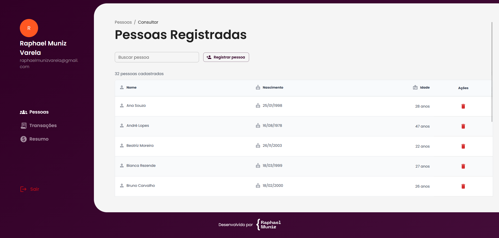
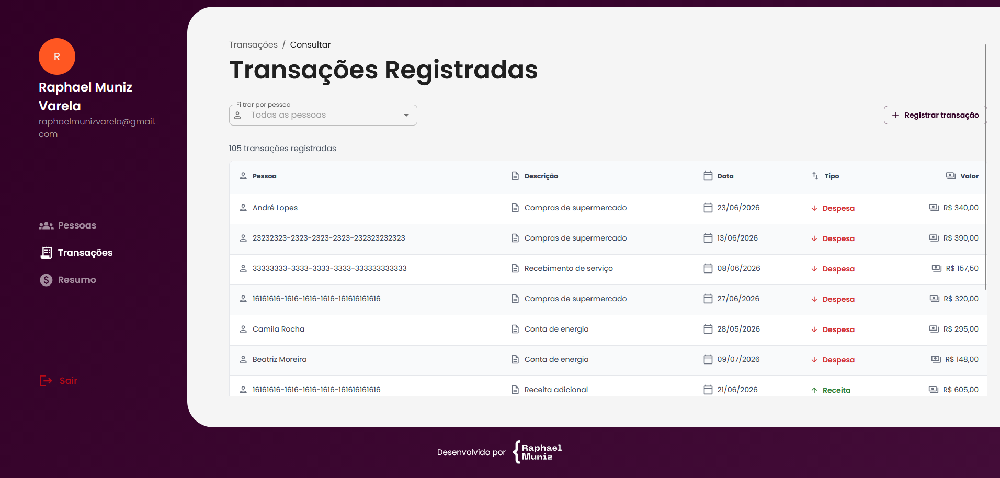
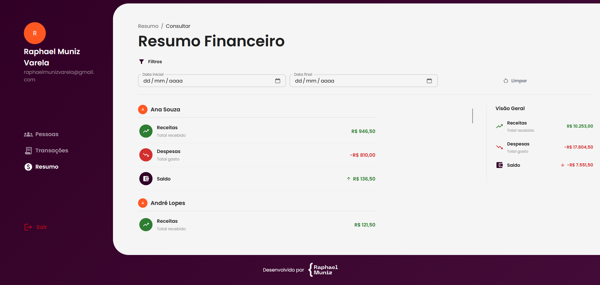
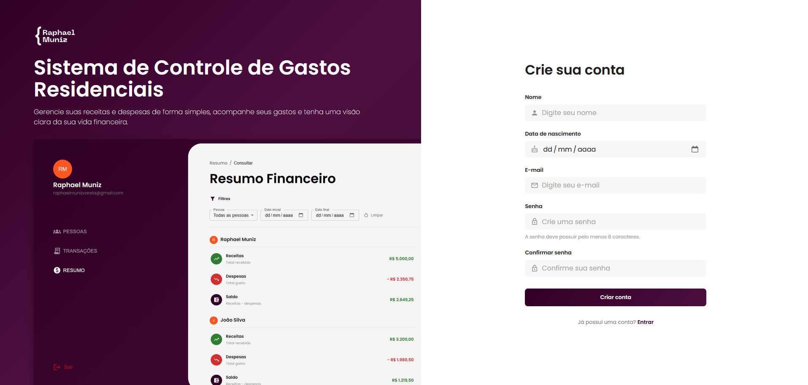

# Sistema de Controle de Gastos Residenciais

<div align="center">


<br><br>

Frontend React para o **Sistema de Controle de Gastos Residenciais**, integrado a uma API .NET com autenticação JWT, cadastros, listagens paginadas, filtros e resumo financeiro.

</div>

---

## Visão geral

O projeto é a interface web do sistema de controle de gastos residenciais. Ele permite que o usuário crie uma conta, faça login, cadastre pessoas, registre receitas e despesas, consulte transações e acompanhe totais financeiros por pessoa e no geral.

A aplicação consome uma API REST versionada em `/api/v1`, mantém sessão com token JWT, usa componentes do Material UI e organiza os fluxos em telas protegidas por autenticação.

<div align="center">
<table>
<tr>
<td width="50%" align="center">
  <strong>Pessoas Registradas</strong><br><br>
  
</td>
<td width="50%" align="center">
  <strong>Transações Registradas</strong><br><br>
  
</td>
</tr>
<tr>
<td width="50%" align="center">
  <strong>Resumo Financeiro</strong><br><br>
  
</td>
<td width="50%" align="center">
  <strong>Cadastro de Usuário</strong><br><br>
  
</td>
</tr>
</table>
</div>

---

## Funcionalidades

<table>
<tr>
<td width="33%" valign="top">

### Pessoas

* Cadastro de pessoas
* Consulta paginada
* Busca por nome
* Exclusão de pessoa
* Exibição de idade calculada pela API

</td>
<td width="33%" valign="top">

### Transações

* Cadastro de receitas e despesas
* Seleção de pessoa via autocomplete
* Regra visual para menores de idade
* Máscara monetária em reais
* Consulta paginada
* Filtro por pessoa

</td>
<td width="33%" valign="top">

### Resumo

* Totais de receitas
* Totais de despesas
* Saldo líquido
* Totais por pessoa
* Filtros por período
* Paginação de resultados

</td>
</tr>
</table>

---

## Autenticação

A autenticação é baseada em JWT.

O usuário pode criar uma conta, fazer login e acessar rotas protegidas. Após o login, o token e a data de expiração são armazenados localmente, e o frontend consulta `GET /auth/me` para reconstruir os dados oficiais do usuário autenticado.

Requisições protegidas enviam:

```text
Authorization: Bearer <token>
```

Quando a sessão expira ou a API retorna `401` em uma rota protegida, o frontend limpa a sessão, redireciona o usuário para a tela de login e exibe o aviso:

```text
Sua sessão expirou. Entre novamente para continuar.
```

O modo `VITE_BYPASS_AUTH=true` existe apenas para desenvolvimento local.

---

## Arquitetura

O frontend segue uma organização por domínio, separando telas, componentes, hooks, serviços, schemas e tipos.

<table>
<tr>
<td width="50%" valign="top">

### Principais bibliotecas

* React
* TypeScript
* Vite
* React Router
* TanStack Query
* React Hook Form
* Zod
* Material UI
* SCSS

</td>
<td width="50%" valign="top">

### Responsabilidades

* `services`: comunicação com a API
* `hooks`: cache, queries e mutations
* `schemas`: validação de formulários
* `types`: contratos internos e DTOs
* `pages`: telas de cada funcionalidade
* `shared`: componentes, API client e utilitários

</td>
</tr>
</table>

O cliente HTTP centraliza headers, token JWT, tratamento de erros, timeout e redirecionamento em caso de sessão expirada.

---

## Regras de negócio

As principais regras refletidas no frontend são:

* Pessoas menores de 18 anos podem registrar apenas despesas.
* Transações devem estar vinculadas a uma pessoa existente.
* O valor da transação deve ser maior que zero.
* A data da transação não pode ser futura.
* A data inicial do resumo não pode ser posterior à data final.
* A exclusão de pessoa é confirmada antes de chamar a API.
* O resumo financeiro usa os totais retornados pela API, sem recalcular totais gerais a partir da página atual.

---

## Como executar

Pré-requisitos:

```text
Node.js
npm
Backend .NET em execução
```

Clone o repositório:

```bash
git clone https://github.com/RaphaelMun1z/react-sistema-controle-gastos-residenciais.git
cd react-sistema-controle-gastos-residenciais
```

Instale as dependências:

```bash
npm install
```

Crie ou ajuste o arquivo `.env`:

```env
VITE_API_URL=http://localhost:7201/api/v1
VITE_BYPASS_AUTH=false
```

### Execução local

Execute o frontend na porta `5173`:

```bash
npm run dev -- --host 0.0.0.0 --port 5173
```

A aplicação ficará disponível em:

```text
http://localhost:5173
```

### Execução com Docker

Construa a imagem:

```bash
docker build --build-arg VITE_API_URL=http://localhost:7201/api/v1 --build-arg VITE_BYPASS_AUTH=false -t react-sistema-controle-gastos-residenciais .
```

Inicie o container na porta `5173`:

```bash
docker run --rm --name controle-gastos-frontend -p 5173:80 react-sistema-controle-gastos-residenciais
```

Comandos úteis:

```bash
npm run build
npm test
npm run lint
npm run test:e2e
```

---

## Estrutura resumida

```text
src/
├── app/
│   ├── providers/
│   ├── query/
│   └── routes/
├── assets/
│   └── images/
├── features/
│   ├── authentication/
│   ├── people/
│   ├── summary/
│   └── transactions/
├── shared/
│   ├── api/
│   ├── components/
│   ├── config/
│   └── utils/
├── styles/
└── test/
```

---

## Relato de bugs

Encontrou algum comportamento inesperado?

[Abra uma issue](https://github.com/RaphaelMun1z/react-sistema-controle-gastos-residenciais/issues/new) descrevendo:

* o problema encontrado;
* os passos para reproduzir;
* o resultado esperado;
* prints ou mensagens de erro, quando houver.
